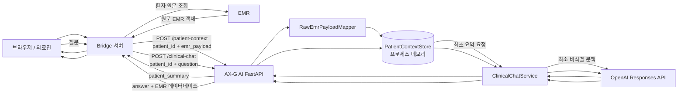
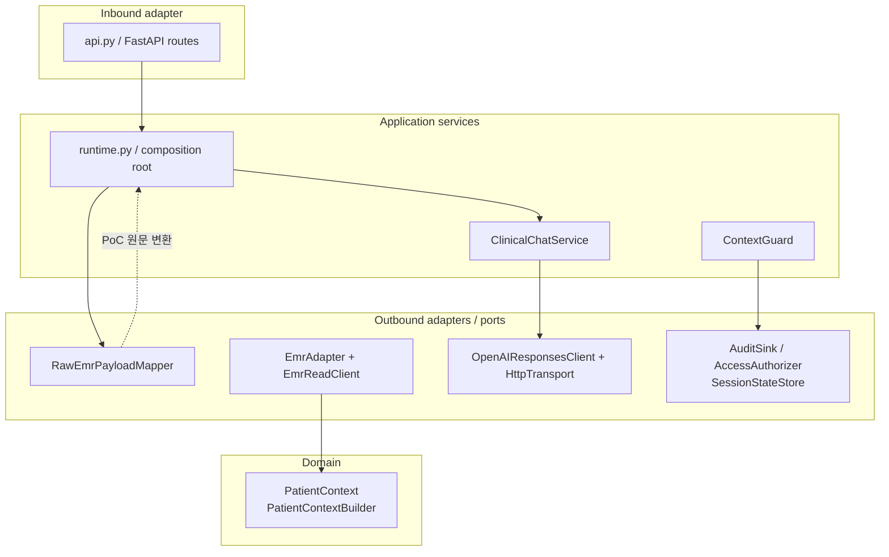
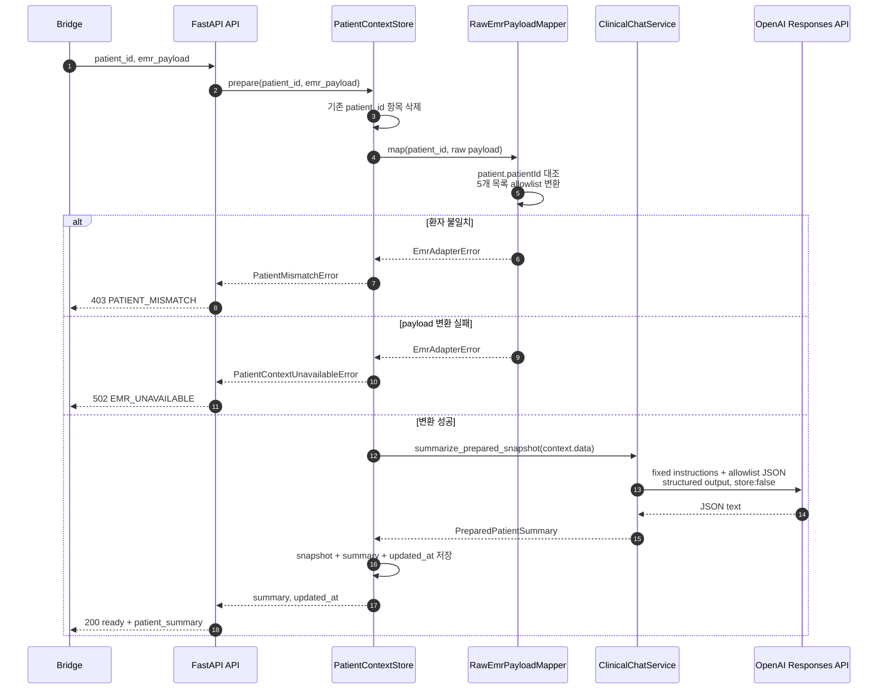
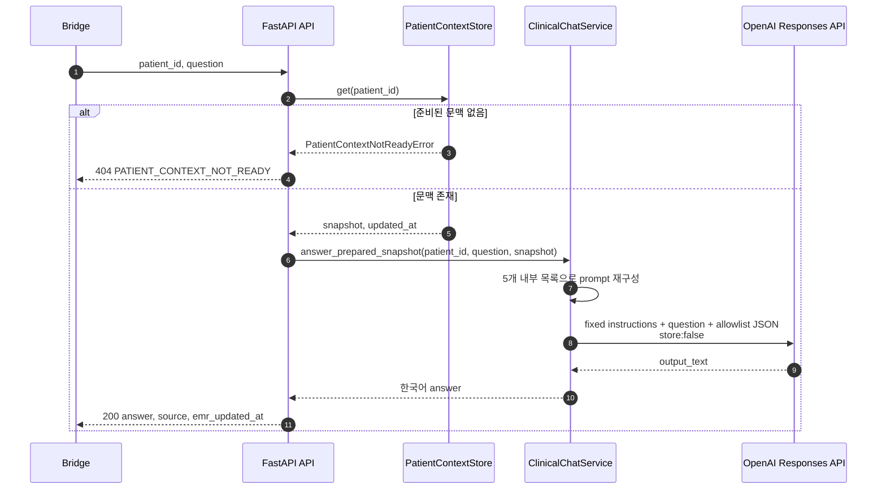
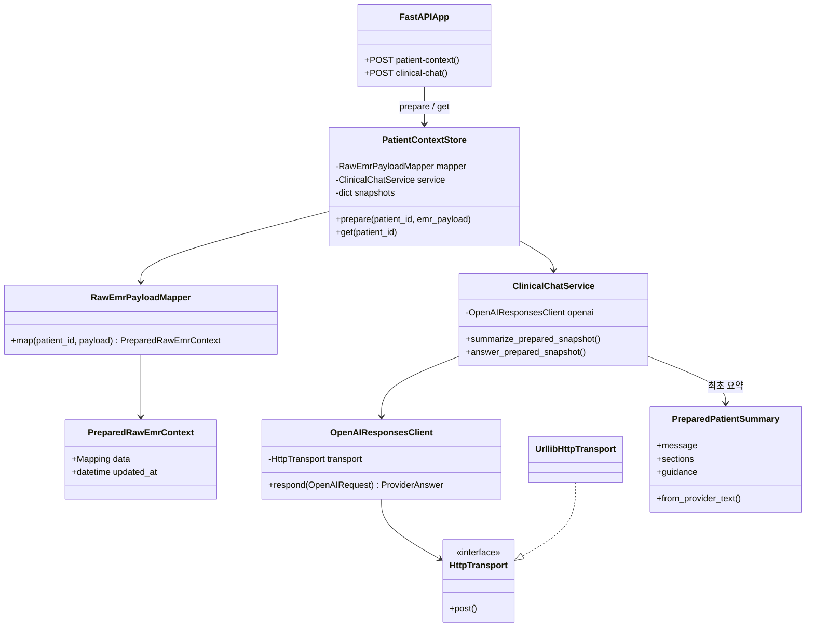
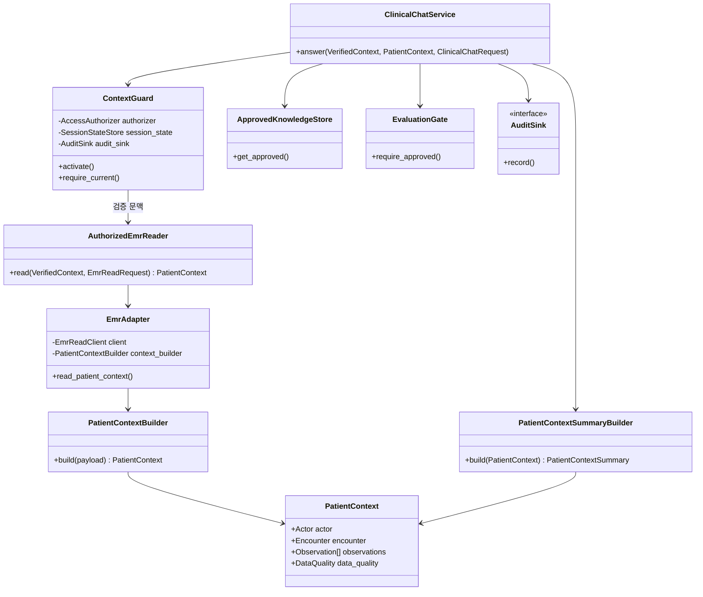

# 현재 아키텍처와 데이터 파이프라인

> 기준 코드: 2026-09-30 / 범위: `src/ax_g_ai`의 현재 구현
>
> 이 문서는 **현재 실제 런타임에 연결된 PoC 경로**와, 코드에 함께 존재하는
> **차세대(정규 Patient Context) 경로**를 구분한다. 후자를 이미 운영 중인 기능으로
> 해석해서는 안 된다.

## 한눈에 보기

현재 서비스는 Bridge가 이미 조회한 원문 EMR을 내부 API로 전달하면, AX-G AI가
환자 ID를 대조하고 5개 목록만 최소 문맥으로 축소해 프로세스 메모리에 보관한 뒤
OpenAI Responses API로 최초 요약과 채팅 답변을 만드는 서버다. 데이터베이스,
영속 캐시, 대화 이력은 사용하지 않는다.

Docker 구성에서는 `bridge-ai` 내부 네트워크가 Bridge와 AX-G AI를 연결하고,
`ai-provider-egress`만 AX-G AI의 OpenAI 호출에 사용한다.

## 설계 렌즈: 현재 적용된 것

### 1. Layered Architecture + Ports and Adapters(부분적 Hexagonal)

`api → runtime → services/domain → adapters`로 관심사를 나눈 계층형 구조다.
HTTP/FastAPI는 API 계층, 유스케이스 조합은 service 계층, EMR·OpenAI HTTP 통신은
adapter 계층에 둔다. `Protocol` 기반의 `HttpTransport`, `AuditSink`,
`AccessAuthorizer`, `SessionStateStore`, `EmrReadClient`는 외부 구현을 바꿀 수 있는
포트 역할을 한다.

다만 **엄격한 Hexagonal Architecture는 아니다.** 예를 들어
`ClinicalChatService`가 `OpenAIResponsesClient`라는 구체 adapter를 직접 타입으로
참조하며, 현재 PoC의 API 경로는 EMR adapter 포트를 통하지 않고 Bridge가 전달한
payload를 직접 받는다. 따라서 현 상태를 가장 정확히 표현하면
**“Ports and Adapters 요소를 채택한 계층형 PoC”**다.

### 2. Clean Architecture의 의도와 현실

도메인 모델(`PatientContext`, `Observation`, `DataQuality`)은 불변 dataclass로
외부 I/O 없이 품질 판정과 정규화를 수행한다. `PatientContextBuilder`가 도메인
규칙을 캡슐화하고, `EmrAdapter`가 외부 EMR 응답을 이 모델로 옮긴다. 이는 Clean
Architecture의 의존성 역전과 유스케이스 중심 분리에 가까운 설계다.

그러나 이 구조는 현재 활성 PoC 요청에서 사용되지 않는다. 활성 경로는
`RawEmrPayloadMapper`의 단순 allowlist DTO를 사용하며, `PatientContextBuilder`,
`AuthorizedEmrReader`, `EmrAdapter.read_patient_context`는 차세대/레거시 호환 경로로
남아 있다. 따라서 “Clean Architecture로 완성됐다”보다 **“Clean Architecture를
향한 확장 경로가 코드에 준비돼 있다”**가 정확하다.

### 3. Application Service / Orchestrator 패턴

`ClinicalChatService`는 정책과 순서를 조합하는 application service다. 일반 경로의
`answer()`는 현재 문맥 확인 → 평가 승인 → 지식 근거 조회 → 최소 요약 → Provider
호출 → 감사 기록을 오케스트레이션한다. 활성 PoC에서 쓰는
`answer_prepared_snapshot()`과 `summarize_prepared_snapshot()`은 준비된 최소
snapshot에 대해 Provider 호출만 수행하는 간소화된 유스케이스다.

### 4. Adapter, Anti-corruption boundary, DTO

`RawEmrPayloadMapper`와 `EmrAdapter`는 외부 EMR의 필드명·HTTP·오류 형식이 내부로
번지지 않게 하는 adapter/anti-corruption boundary다. API body, OpenAI request,
환자 요약, 감사 이벤트는 모두 별도 dataclass/Pydantic DTO로 표현한다. 특히
`PreparedPatientSummary`는 모델의 structured output JSON을 검증한 뒤 화면 계약으로
변환한다.

### 5. Builder와 allowlist 기반 Data Minimization

두 Builder/Mapper가 서로 다른 입력 계약을 처리한다.

| 구성요소 | 입력 | 출력 | 사용 상태 |
|---|---|---|---|
| `RawEmrPayloadMapper` | Bridge 원문 EMR | 5개 목록의 PoC 최소 문맥 | **현재 활성** |
| `PatientContextBuilder` | 정규 Snapshot | 불변 `PatientContext` + 품질 상태 | 차세대/미연결 |
| `PatientContextSummaryBuilder` | `PatientContext` | Provider용 비식별 요약 | 차세대/미연결 |

두 경로 모두 필요한 필드만 선택하는 allowlist 방식을 사용한다. 이는 단순 DTO 변환을
넘어 환자 식별자, 자유기술, 원문 전체가 Provider로 전달되는 것을 막는 개인정보
최소화 경계다.

### 6. Guard/Gateway, Repository-like Store, Fail-closed

`ContextGuard`는 세션당 하나의 검증 문맥을 유지하고 환자/에피소드 전환 시 세션
상태를 지우는 guard/gateway 패턴이다. `PatientContextStore`는 저장소 인터페이스와
유사하지만 영속 repository가 아니라 환자 ID 키의 **프로세스 메모리 cache**다.

새 준비가 시작되면 기존 항목을 먼저 삭제하고, 변환과 최초 요약이 모두 성공해야만
새 항목을 저장한다. 따라서 실패 시 오래된 환자 문맥을 답변에 재사용하지 않는
fail-closed 전략을 취한다.

## 현재 활성 데이터 파이프라인

### A. 환자 준비: `POST /internal/v1/patient-context`

입력 원문에서 실제 저장·Provider 전송 후보로 변환되는 필드는 다음뿐이다.

| 원문 목록 | 내부 키 | 허용 필드/고정 단위 | 제외 예 |
|---|---|---|---|
| `bloodPressureList` | `blood_pressure` | `measuredAt`, `sbp`, `dbp`, `mmHg` | null 수치, 환자 정보 |
| `bloodSugarList` | `blood_sugar` | `measuredAt`, `glucoseValue`, `timingType`, `mg/dL` | null 수치 |
| `oxygenSaturationList` | `oxygen_saturation` | `measuredAt`, `spo2Value`, `%` | null 수치 |
| `labResultList` | `lab_results` | `examCode`, `itemName`, 짧은 `value`, `testDate` | 긴 값, 기타 원문 필드 |
| `medicineDtailList` | `prescriptions` | 코드·명칭·분류·용량·단위·횟수·간격·기간 | `instructions` 등 비허용 필드 |

목록이 없거나 `null`이면 빈 배열이 된다. 측정/검사 일시가 없거나 필요한 수치가
`null`인 행은 제외한다. `emr_updated_at`은 허용된 측정·검사 시각 중 최댓값이며,
없으면 준비 시각(UTC)을 사용한다.

### B. 채팅: `POST /internal/v1/clinical-chat`

현재 구현은 “질문 관련 항목만”을 의미론적으로 재선택하지는 않는다.
`compose_prepared_snapshot_question()`은 허용된 5개 내부 목록을 모두 prompt에 넣는다.
질문별 추가 축소는 향후 개선 항목이다.

## 활성 클래스 관계

## 코드에 존재하지만 활성 PoC 경로에 연결되지 않은 구조

정규 `PatientContext` 경로는 더 풍부한 권한, 데이터 품질, 승인 지식 근거, 평가,
감사 기능을 표현한다. 현재 `create_runtime_app()`은 `_AllowAllAuthorizer`,
`_NoopSessionState`, `InMemoryAuditSink`를 조립하지만, 활성 API는
`ClinicalChatService.answer()`가 아닌 `answer_prepared_snapshot()`을 호출한다.
따라서 아래 요소는 **현재 Bridge PoC 요청의 실행 제어에는 적용되지 않는다.**

- `ContextGuard`의 실제 RBAC/환자-에피소드 권한 검증과 세션 전환 보호
- `AuthorizedEmrReader`와 `EmrAdapter.read_patient_context()`를 통한 EMR 직접 조회
- `PatientContextBuilder`의 표준 코드·결과 상태·데이터 품질 판정
- `ApprovedKnowledgeStore`의 승인/유효기간 근거 선택
- `EvaluationGate`의 모델·프롬프트·지식 버전 승인 게이트
- `ClinicalChatService.answer()`의 AI 호출 감사 이벤트 기록

## 현재 보안·운영 특성 및 경계

| 주제 | 현재 구현 | 주의할 점 |
|---|---|---|
| 요청 상관관계 | `X-Request-ID`를 생성/반환하고 실패 로그에 기록 | body/EMR/질문은 로그에 쓰지 않음 |
| Provider 전송 | 고정 지시 + allowlist EMR JSON, `store: false` | 실제 PHI 외부 전송 전 별도 개인정보·보안 승인이 필요 |
| 환자 혼입 방지 | 바깥 `patient_id`와 `payload.patient.patientId` 대조, 준비 실패 시 이전 항목 제거 | 현재 API 레벨의 호출자 인증·인가 자체는 Bridge 책임 |
| 상태 보관 | 환자별 프로세스 메모리 | 재시작/다중 replica에서 소멸 또는 공유되지 않음 |
| 오류 | API에서 안전 코드로 변환 | Provider 원문 오류와 API key를 응답/로그에 노출하지 않음 |
| EMR 최신성 | 변환된 항목의 가장 최신 시각 또는 준비 시각 | 원문 전체의 공식 snapshot 시각을 보장하지 않음 |

## 운영 수준으로 확장할 때의 연결 순서

1. Bridge 인증 정보를 API 경계에서 검증하고, 실제 `AccessAuthorizer`와
   `ContextGuard.activate()`를 환자 준비 전에 연결한다.
2. `AuthorizedEmrReader`/`EmrAdapter` 또는 동등한 검증 경계를 활성 요청 경로에
   연결해 환자·에피소드·기간·시간대 일치를 확인한다.
3. PoC raw mapper와 정규 `PatientContextBuilder`의 입력 계약을 하나로 정리하고,
   코드/단위/결과 상태·데이터 품질을 운영 규칙으로 확정한다.
4. `ClinicalChatService.answer()` 경로로 전환해 평가 승인, 승인 지식 근거, 영속
   감사 sink를 실제 호출에 적용한다.
5. 프로세스 메모리 정책을 명시적으로 유지할지, TTL·암호화·격리·무효화를 갖춘
   공유 저장소를 도입할지 결정한다. 다중 인스턴스 운영에서는 현재 저장소만으로
   준비 상태를 보장할 수 없다.

## 관련 파일

- 진입점/API: `src/ax_g_ai/api.py`, `src/ax_g_ai/runtime.py`
- 활성 PoC 변환/채팅: `src/ax_g_ai/adapters/main_bridge.py`,
  `src/ax_g_ai/services/clinical_chat.py`, `src/ax_g_ai/services/prepared_patient_summary.py`
- OpenAI 경계: `src/ax_g_ai/adapters/openai.py`
- 정규 도메인·확장 경로: `src/ax_g_ai/domain/patient_context.py`,
  `src/ax_g_ai/services/access_policy.py`, `src/ax_g_ai/adapters/emr.py`,
  `src/ax_g_ai/services/patient_context_summary.py`, `src/ax_g_ai/services/knowledge.py`,
  `src/ax_g_ai/services/evaluation.py`, `src/ax_g_ai/services/audit.py`
- API 계약: `docs/contracts/bridge-ai-api-spec.md`
