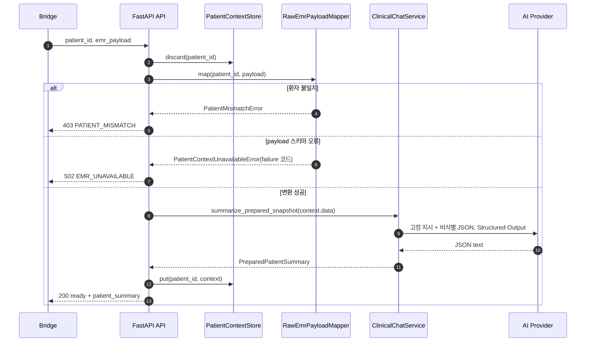
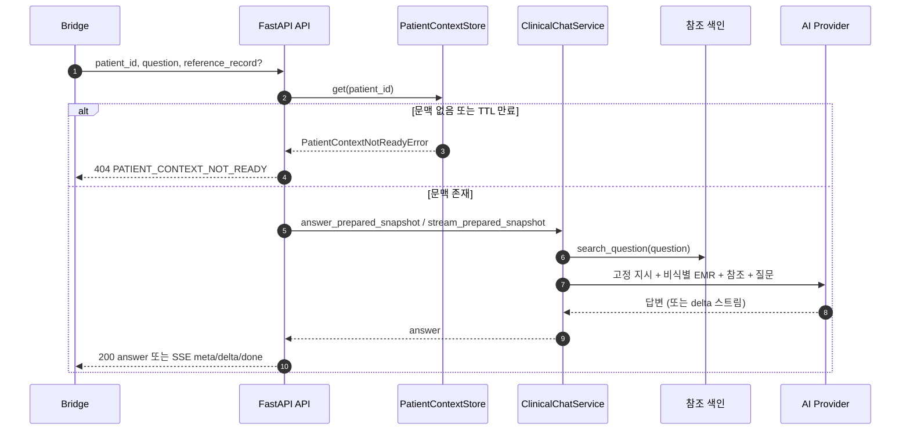

# 현재 아키텍처와 데이터 파이프라인

> 기준 코드: 2026-10-30 / 범위: `src/ax_g_ai`의 현재 구현

## 한눈에 보기

Bridge가 이미 조회한 원문 EMR을 내부 API로 전달하면, AX-G AI는 환자 ID를 대조하고
허용 목록과 비식별 처리를 거친 최소 문맥을 만든다. 이 문맥을 프로세스 메모리에 보관해 두고
AI Provider로 최초 요약과 채팅 답변을 생성한다. Provider는 OpenAI Responses API이거나
vLLM 같은 OpenAI 호환 Chat Completions 서버다. 영속 저장소와 대화 이력은 사용하지 않는다.
읽기 전용 참조 SQLite는 선택 사항이다.

```mermaid
flowchart LR
    Bridge[Bridge 서버] -->|POST /patient-context\npatient_id + emr_payload| API[AX-G AI FastAPI\nasync]
    API --> Mapper[RawEmrPayloadMapper\n허용 목록 + 비식별 경계]
    Mapper -.약품·상병 코드.-> Ref[(참조 SQLite\n읽기 전용)]
    Mapper --> Store[(ContextStore\nTTL 메모리 또는 Redis)]
    API --> Chat[ClinicalChatService]
    Chat -.질문에 명시된 약품·상병명.-> Ref
    Chat -->|고정 지시 + 비식별 문맥| SDK[OpenAI SDK\n연결 풀·재시도·SSE]
    SDK --> Provider[OpenAI Responses /\nvLLM Chat Completions]
    API -->|JSON 또는 SSE| Bridge
```

Docker 구성에서는 `bridge-ai` 내부 네트워크가 Bridge와 AX-G AI를 연결하고,
`ai-provider-egress`는 AX-G AI가 Provider를 호출할 때만 쓴다.

## 모듈 구성

의존 방향은 `corpus`·`jsonl` ← `services` ← `adapters`·`corpus_store`·`dur_store` ← `api`·`runtime` 한 방향이다.
서비스는 어댑터·저장소를 import하지 않고(Provider 경계는 서비스의 `services/ports.py`에 정의), 오프라인 적재기는
요청 경로 서비스를 import하지 않는다. 규칙은 `tests/test_architecture.py`가 검사한다.

| 계층 | 모듈 | 책임 |
|---|---|---|
| 진입점 | `api.py` | 라우트, 요청 검증, 도메인 예외를 안전한 오류 코드로 변환, SSE 직렬화, 종료 시 자원 정리(lifespan) |
| 조립 | `runtime.py`, `config.py` | `pydantic-settings`로 환경 설정 검증, 의존성 조립, 설정 오류 시 fail-closed 앱 생성. 서버는 `uvicorn --factory ax_g_ai.runtime:create_runtime_app`으로 기동 |
| 말뭉치 계약 | `corpus/files.py`, `corpus/gate.py`, `corpus/text.py`, `jsonl.py` | 말뭉치 파일 이름·기본 임베딩 모델, 인용 게이트 `is_citable`(유일한 Python 정의), 검색 토큰화, JSONL 읽기. 표준 라이브러리만 사용 |
| 서비스 | `services/ports.py` | 서비스가 정의하고 어댑터가 구현하는 AI Provider 경계(`ProviderClient`, 요청·응답·오류 타입) |
| 서비스 | `services/clinical_chat.py` | Provider 요청 조립, Provider 실패 분류와 로그 |
| 서비스 | `services/patient_context_store.py` | 준비된 비식별 문맥(`PreparedRawEmrContext`), 비동기 저장소 인터페이스 `ContextStore`, 기본 구현(TTL·최대 개수 제한 프로세스 메모리), 외부 저장용 JSON 형식 |
| 서비스 | `services/corpus_snapshot.py` | 요청 하나가 쓰는 말뭉치 스냅샷(근거 검색·규칙·DUR, 같은 릴리스)과 `CorpusSource` 인터페이스 |
| 서비스 | `services/clinical_recommendation/` | 추천 의견: `rules`(2단계 판정), `doses`(3단계), `presentation`(항목·라벨), `schema`(결과 Pydantic 모델, [assessment_schema.md](assessment_schema.md)), `corpus`, `model` |
| 서비스 | `services/prepared_patient_summary.py` | 최초 요약의 Pydantic 계약: Structured Output 스키마, 응답 검증, API 본문 |
| 서비스 | `services/reference_lookup.py` | 참조 SQLite 조회. 약품·상병명은 메모리 색인으로 질문 매칭 |
| 서비스 | `services/deidentified_snapshot.py` | 식별자 키 제거 규칙(유일한 정의) |
| 서비스 | `services/clinical_calculations.py` | BMI·체표면적·CrCl·CKD-EPI 2021 eGFR(GFR 범주 포함) 결정적 계산 보조값 |
| 서비스 | `services/clinical_corpus.py` | 규칙 조건식의 환자 사실(`PatientFacts`)과 3값 평가 |
| 서비스 | `services/clinical_evidence.py` | 질문에 맞는 최신화 근거 문단(`corpus/chunks.jsonl`)을 찾아 채팅 프롬프트와 응답 `evidence`에 출처와 함께 붙임(1단계 근거 인용). A등급 출처·원문 확인 항목만, 미검수 항목은 설정으로 켰을 때만(경고 표시 없이 출처로 근거를 밝힘) |
| 서비스 | `services/emr_mapping.py` | EMR 검사·처방·상병을 말뭉치 개념(`corpus/test_concepts.jsonl` 등)과 사이트 코드 매핑으로 `PatientFacts`로 변환(단위 확인·범위 검사). 추천 의견(2·3단계)의 입력 |
| 어댑터 | `adapters/main_bridge.py` | 원문 EMR을 비식별 최소 문맥으로 변환하는 **유일한 PHI 경계** |
| 어댑터 | `adapters/redis_context_store.py` | 여러 워커·인스턴스가 공유하는 Redis 문맥 저장소(asyncio, 키는 환자 ID의 SHA-256) |
| 저장소 | `corpus_store/live.py` | 활성 말뭉치 릴리스·DUR 데이터셋을 주기적으로 확인해 스냅샷을 통째로 교체 |
| 어댑터 | `adapters/openai.py`, `adapters/provider.py` | `services/ports.py`를 구현하는 OpenAI SDK 기반 Responses / Chat Completions Client와 그 선택 |
| 프롬프트 | `prompts/clinical.py` | 고정 지시와 입력 템플릿 |
| 공통 | `errors.py` | API가 HTTP 상태로 바꾸는 도메인 예외 |

## 동시성과 성능 특성

- **비동기 처리**: 모든 엔드포인트가 `async`이고 Provider 호출에는 `AsyncOpenAI`를 쓴다.
  Provider 응답을 기다리는 동안 스레드를 점유하지 않는다. 그래서 동시 요청이 스레드풀
  크기(기본 40)에 묶이지 않고, 부하가 걸려도 `/health`가 지연되지 않는다.
- **연결 재사용과 재시도**: SDK Client 하나가 keep-alive 연결 풀을 공유한다. 첫 토큰을
  받기 전에 연결 오류, 429, 5xx가 나면 `AI_MAX_RETRIES`(기본 2)만큼 지수 백오프로 재시도한다.
- **참조 검색**: 시작 시 약품·상병명 목록을 메모리에 적재해 질문과 매칭하고, 필요한 참조 내용을 SQLite에서 읽는다.
- **말뭉치 스냅샷**: 요청은 시작할 때 스냅샷 하나를 읽어 끝까지 쓴다. 그래서 인용 근거·규칙 결과·DUR이 두 릴리스에
  섞이지 않는다. PostgreSQL을 쓰면 백그라운드 스레드가 `AX_G_CORPUS_REFRESH_SECONDS`(기본 60)마다 활성 릴리스·DUR
  데이터셋을 확인하고, 바뀌었으면 새 스냅샷을 다 만든 뒤 한 번에 교체한다. 요청 경로는 갱신을 기다리지 않는다.
  빌드 중 다른 릴리스가 활성화되거나 빌드가 실패하면 현재 스냅샷을 유지한다. DB를 쓸 수 없으면 근거와 규칙을
  모두 파일 말뭉치에서 읽어 기동 시점으로 고정한다(한쪽만 DB인 경우는 없다). 준비된 환자 문맥은 자신의 릴리스를
  기억하고, 더 새 릴리스가 활성화되면 저장해 둔 규칙 입력(`rule_source`)으로 사실을 다시 매핑한다(약 0.1 ms).
- **동시 호출**: 추천 의견의 소견 추출(LLM)과 근거 검색은 서로 의존하지 않으므로 동시에 실행한다.
- **환자 문맥 저장소**: 기본은 프로세스 메모리(조회 1 µs 미만)이다. `AX_G_PATIENT_CONTEXT_REDIS_URL`을 설정하면
  Redis(조회 약 0.3 ms, asyncio)를 쓰며, 이때 `WEB_CONCURRENCY`로 워커를 늘릴 수 있다(`compose.redis.yaml`).
- **Prefix cache**: 고정 지시와 환자 EMR을 앞에, 요청마다 달라지는 참조·형식·질문을 뒤에 둔다.
  그래서 같은 환자의 후속 질문은 Provider가 지원하는 경우 prefix cache를 재사용할 수 있다.

## 데이터 파이프라인

### A. 환자 준비: `POST /internal/v1/patient-context` (`/stream`)

```mermaid
sequenceDiagram
    autonumber
    participant B as Bridge
    participant A as FastAPI API
    participant S as PatientContextStore
    participant M as RawEmrPayloadMapper
    participant C as ClinicalChatService
    participant P as AI Provider

    B->>A: patient_id, emr_payload
    A->>S: discard(patient_id)
    A->>M: map(patient_id, payload)
    alt 환자 불일치
        M-->>A: PatientMismatchError
        A-->>B: 403 PATIENT_MISMATCH
    else payload 스키마 오류
        M-->>A: PatientContextUnavailableError(failure 코드)
        A-->>B: 502 EMR_UNAVAILABLE
    else 변환 성공
        A->>C: summarize_prepared_snapshot(context.data)
        C->>P: 고정 지시 + 비식별 JSON, Structured Output
        P-->>C: JSON text
        C-->>A: PreparedPatientSummary
        A->>S: put(patient_id, context)
        A-->>B: 200 ready + patient_summary
    end
```

`/stream` 변형은 변환 직후 문맥을 저장하고 `meta` 이벤트를 보낸 다음 요약을 스트리밍한다.
요약이 `done` 전에 실패하면 문맥을 삭제한다. `/internal/v1/emr-summary`(`/stream`)는 같은
변환을 거치지만 문맥을 저장하지 않는다.

매퍼가 정규화하는 목록은 다음과 같다. 그 밖의 최상위 필드는 `additional_clinical_data`에
보존하되 식별자 키를 재귀적으로 제거한다. 허용 필드 안에 중첩 객체가 있어도 같은 비식별
규칙을 거친다. 비어 있는 목록은 프롬프트 토큰만 늘리므로 문맥에서 뺀다.

| 원문 목록 | 내부 키 | 허용 필드/고정 단위 |
|---|---|---|
| `bloodPressureList` | `blood_pressure` | `measuredAt`, `sbp`, `dbp`, `mmHg` |
| `bloodSugarList` | `blood_sugar` | `measuredAt`, `glucoseValue`, `timingType`, `mg/dL` |
| `oxygenSaturationList` | `oxygen_saturation` | `measuredAt`, `spo2Value`, `%` |
| `labResultList` | `lab_results` | `examCode`, `itemName`, 짧은 `value`, `testDate` |
| `medicineDtailList` | `prescriptions` | 코드·명칭·분류·용량·단위·횟수·간격·기간, 참조 DB 효능·주의사항 |
| `diagnosisList` | `diagnoses` | `diagnosisCode`/`kcdCode`, 참조 DB 또는 원문 상병명 |
| `calculationContext` | `calculation_results`, `calculation_input_needed` | 결정적 계산값과 부족한 입력 안내 |

`emr_updated_at`은 허용된 측정·검사 시각 중 가장 늦은 시각이다. 그런 시각이 없으면 준비 시각(UTC)을 쓴다.

### B. 채팅: `POST /internal/v1/clinical-chat` (`/stream`)

```mermaid
sequenceDiagram
    autonumber
    participant B as Bridge
    participant A as FastAPI API
    participant S as PatientContextStore
    participant C as ClinicalChatService
    participant R as 참조 색인
    participant P as AI Provider

    B->>A: patient_id, question, reference_record?
    A->>S: get(patient_id)
    alt 문맥 없음 또는 TTL 만료
        S-->>A: PatientContextNotReadyError
        A-->>B: 404 PATIENT_CONTEXT_NOT_READY
    else 문맥 존재
        A->>C: answer_prepared_snapshot / stream_prepared_snapshot
        C->>R: search_question(question)
        C->>P: 고정 지시 + 비식별 EMR + 참조 + 질문
        P-->>C: 답변 (또는 delta 스트림)
        C-->>A: answer
        A-->>B: 200 answer 또는 SSE meta/delta/done
    end
```

스트리밍은 첫 delta를 받은 뒤에야 HTTP 200을 확정한다. 그 전에 실패하면 JSON 502를
반환한다. 200 이후에 실패하면 Provider 상세 없이 `error` SSE 이벤트만 보낸다.

## 보안·운영 특성

| 주제 | 현재 구현 | 주의할 점 |
|---|---|---|
| 요청 상관관계 | `X-Request-ID`를 생성·반환하고 실패 로그에 기록 | body·EMR·질문은 로그에 쓰지 않음 |
| PHI 경계 | `RawEmrPayloadMapper` 한 곳에서 허용 목록과 식별자 제거를 수행. 저장된 문맥이 곧 Provider 입력 | 새 입력 경로를 추가할 때는 반드시 이 매퍼를 거칠 것 |
| Provider 전송 | 고정 지시 + 비식별 EMR JSON 및 질문·선택적 참고 기록, OpenAI는 `store: false` | 실제 PHI를 외부로 보내기 전에 별도 개인정보·보안 승인이 필요 |
| 자격 증명 격리 | `openai_compatible`에서는 `OPENAI_*` 값과 SDK의 환경 변수 Key를 읽지 않음 | |
| 환자 혼입 방지 | 바깥 `patient_id`와 `payload.patient.patientId`를 대조하고, 준비 실패 시 이전 항목 제거 | 호출자 인증·인가는 Bridge 책임 |
| 상태 보관 | 환자별 프로세스 메모리(기본), `AX_G_PATIENT_CONTEXT_TTL_SECONDS`(기본 12시간)·`AX_G_PATIENT_CONTEXT_MAX_ENTRIES`(기본 1000). `AX_G_PATIENT_CONTEXT_REDIS_URL`이면 Redis(같은 TTL, 개수 대신 `maxmemory`) | 메모리: 재시작하면 사라지고 워커 사이에 공유되지 않음. Redis: 내부망 전용·디스크 저장 없음·비밀번호 필수(`compose.redis.yaml`), 비식별 문맥 JSON만 저장, 장애 시 `EMR_UNAVAILABLE` |
| 근거 인용 | `AX_G_EVIDENCE_CORPUS_DIR`(없으면 끔), `AX_G_EVIDENCE_INCLUDE_UNREVIEWED`(기본 false), `AX_G_EVIDENCE_MAX_CHUNKS`(기본 3). 채팅 응답·SSE `meta`에 `evidence`(번호·근거 문단·검수 상태·출처·충돌)를 넣고, 근거가 없으면 필드를 생략 | 로그에는 근거 ID와 미검수 개수만 남기고 질문은 쓰지 않음. `AX_G_CORPUS_DATABASE_URL`이 있으면 PostgreSQL(pgvector) 하이브리드 검색(어휘 + KURE-v1 의미 검색), 연결 실패 시 파일 어휘 검색으로 대체. 구조는 [clinical_corpus_postgres.md](clinical_corpus_postgres.md) |
| 출처 표시 가능 자료만 사용 | `AX_G_ATTRIBUTED_SOURCES_ONLY`(기본 true). 근거·규칙은 모든 출처에 라이선스(CC0·CC BY·퍼블릭 도메인)·제목이 있을 때만 인용하고 `sources[].license`·`citation`을 응답에 넣음. 출처 미확인 참조 DB(`AX_G_REFERENCE_DATA_DB_PATH`)는 설정돼 있어도 끔. 추천 의견은 말뭉치 근거가 있는 제안만 | 라이선스는 빌드 시 `registry.yaml`의 `license_basis`에서 뽑고, A등급인데 라이선스를 못 정하면 빌드 실패(`build_corpus.py`). 참조 DB는 이미지에 없으므로, 이 설정을 끄더라도 DB를 마운트하고 `AX_G_REFERENCE_DATA_DB_PATH`를 지정해야 쓰인다 |
| DUR 처방 점검 | `AX_G_DUR_ENABLED`(기본 true). 말뭉치와 같은 PostgreSQL의 `dur` 스키마(데이터셋·제품·병용·연령·임부·노인주의 표)에서 활성 데이터셋을 시작 시 메모리로 읽음. 심평원 DUR CSV → `ax-g-ai-build-dur`(스냅샷 `data/dur`, 이미지 포함) → compose `dur-loader`(`ax-g-ai-load-dur`)가 적재·활성화. EMR 처방 제품코드로 병용금기·연령금기·임부금기·노인주의를 점검해 `assessment.medication_alerts`로 반환 | 제품코드 일치만 사용(이름 추정 없음), 미일치는 `unmapped`. DB·활성 데이터셋이 없으면 경고 후 끔(파일 대체 없음). 새 데이터셋은 말뭉치 릴리스와 같은 주기로 자동 반영(스냅샷 교체), 롤백은 `--activate`. 용량주의·투여기간주의는 원본 파일 확보 후 추가. 공공누리 제1유형 — 출처 표시 |
| 추천 진단·검사(2단계) | `AX_G_CLINICAL_RULES_ENABLED`(기본 true). 말뭉치 진단·검사·협진·추적 규칙을 근거와 같은 게이트로 불러오고(DB 활성 릴리스 → 파일), EMR 준비 시 `emr_mapping`으로 개념 사실(검사값·KCD·성분)을 만들어 문맥에 함께 보관. `/internal/v1/clinical-recommendations`에서 3값 논리로 평가해 `met`/`possible` 항목·근거 번호·출처·검수 표시를 반환하고 LLM이 의견을 작성. 병원 코드 매핑은 `AX_G_SITE_CODE_MAP_PATH` | 미검수 규칙은 `AX_G_EVIDENCE_INCLUDE_UNREVIEWED`일 때만. `clinical_note`는 매퍼를 거치지 않고 Provider로 감(소견 키 추출 + 의견 생성). 규칙은 근거와 같은 스냅샷으로 새 릴리스를 자동 반영. 로그에는 건수만 |
| 약물 용량 참고(3단계) | `AX_G_CLINICAL_DOSES_ENABLED`(코드 기본 false). 말뭉치 `dose_rules`를 현재 처방 약(성분·약효군 일치)과 요청 `dose_drugs`에 적용: 체중 공식(`clinical_dosing`의 안전한 계산식 해석기, `eval` 없음), eGFR·CrCl 구간 용량, 용량 조건 규칙(3값), 처방 1일 용량(`dosage`×`frequency`, mg 단위·1일 간격만)과 구간 1일 최대 대조. `assessment.dose_assessments`로 반환하고 LLM은 `용량 참고`로 입력값과 함께 씀 | 2단계와 같은 게이트·검수 표시·출처. 18세 미만·나이 미상은 계산하지 않음. 입력이 없으면 추정하지 않고 `missing`. 출처가 국외이면 `notice`(국내 허가 미대조). 용량 근거 문단은 2단계 근거 상한과 별도로 최대 6개 더 붙임. 치료 선택(`treatment.jsonl`)과 요법만 있는 규칙(약 하나에 묶이지 않음)은 쓰지 않음 |
| 오류 | 도메인 예외 타입을 예외 처리기에서 안전한 코드로 변환. 설정 오류는 필드명·사유만 로그 | Provider 원문 오류와 API Key를 응답·로그에 노출하지 않음 |

## 운영 수준 확장 시 다시 설계할 부분

현재 구현에는 API 자체 인증·인가, 영속 감사 저장소, 평가 승인 게이트가 없다. 운영 전환 시 다음을 검토한다.

1. Bridge 인증 정보를 API 경계에서 검증하고, 환자 준비 전에 사용자·환자 권한을 확인한다.
2. AI 호출의 시작·성공·실패를 질문·답변 원문 없이 영속 감사 저장소에 기록한다.
3. 모델·프롬프트 버전에 대한 평가 승인 게이트와 승인 지식 근거 표시가 필요한지 결정한다.
4. 공유 문맥 저장소(Redis)는 준비되어 있다. 운영 전환 시 TLS(`rediss://`)·접근 계정 분리·저장 데이터 암호화가
   필요한지 결정한다.

## 관련 파일

- 진입점/API: `src/ax_g_ai/api.py`, `src/ax_g_ai/runtime.py`, `src/ax_g_ai/config.py`
- 변환/비식별: `src/ax_g_ai/adapters/main_bridge.py`, `src/ax_g_ai/services/deidentified_snapshot.py`
- 채팅/요약: `src/ax_g_ai/services/clinical_chat.py`, `src/ax_g_ai/services/prepared_patient_summary.py`
- 추천 진단·검사: `src/ax_g_ai/services/clinical_recommendation/`, `docs/assessment_schema.md`, `src/ax_g_ai/services/emr_mapping.py`, `src/ax_g_ai/corpus_store/rules.py`
- Provider 경계: `src/ax_g_ai/services/ports.py`(정의), `src/ax_g_ai/adapters/openai.py`, `src/ax_g_ai/adapters/provider.py`(구현·선택)
- API 계약: `docs/contracts/bridge-ai-api-spec.md`

프롬프트는 `src/ax_g_ai/prompts/clinical.py`에서 관리한다. 환자 준비와 독립 EMR 요약은 기록된 사실을 한 줄로 요약하고 추가로 4~5줄을 요청한다. 자료가 부족하면 추가 줄 수를 줄이며 새로운 추정 진단은 제시하지 않는다. 추천 의견(`clinical-recommendations`)과 추천·검사 의도가 있는 채팅 질문은 말뭉치 규칙 평가 결과를 받아 추정 진단·추천 검사를 제시하며, 말뭉치에 없는 제안에는 `[AI 일반 지식·출처 없음]`을 붙인다. 채팅의 `question`, `reference_record`, 추천 요청의 `clinical_note`는 매퍼를 거치지 않고 Provider에 전달되므로 Bridge에서 식별정보 포함 여부를 관리해야 한다.
